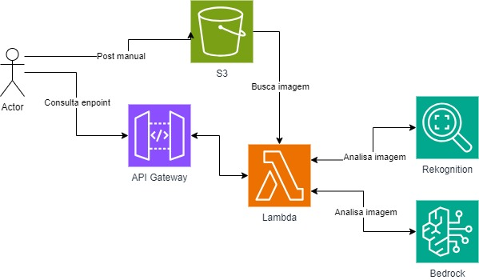

<h1 align="center">Compass Uol Bot</h1>


## 📌 Índice
- [Descrição do Projeto](#-Descrição-do-Projeto)
- [Descrição da API](#-Descrição-da-API)
- [Estrutura de pastas](#-Estrutura-de-pastas)
- [Arquitetura AWS](#️-arquitetura-aws)
- [Como usar o sistema](#-como-usar-o-sistema)
- [Experiências obtidas](#-experiências-obtidas)
- [Tecnologias utilizadas](#-tecnologias-utilizadas)
- [Dificuldades encontradas](#️-dificuldades-encontradas)
- [Autores](#-autores)


## 📖 Descrição do Projeto

## 📂 Estrutura de pastas
```
├── assets
├── visao-computacional
│   ├── .serverless
│   │    ├── cloudformation-template-create-stack.json
│   │    ├── cloudformation-template-update-stack.json
│   │    ├── meta.json
│   │    ├── serverless-state.json
│   │    └── vizions.zip
│   │
│   ├── handlers
│   │    ├── analyzeV1.py
│   │    ├── analyzeV2.py
│   │    ├── descriptions.py
│   │    ├── health.py
│   │    └── utils.py
│   │         
│   ├── gitignore.txt
│   └── serverless.yml     
│                   
├── .gitignore                      
└── README.MD                        
                                           
```


## 🏗️ Arquitetura AWS
  


## 🚀 Como usar o sistema

## ✍️ Exemplos de Requesições

    - V1:
        - 
    - V2:
         - {
             "bucket": "sprint-8-images",
            "imageName": "bird.jpg"
            }

         - {
             "bucket": "sprint-8-images",
            "imageName": "cat.jpg"
            }

         - {
             "bucket": "sprint-8-images",
            "imageName": "dog.jpg"
            }

         - {
             "bucket": "sprint-8-images",
            "imageName": "fish.jpg"
            }

         - {
             "bucket": "sprint-8-images",
            "imageName": "forest.jpg"
            }

         - {
             "bucket": "sprint-8-images",
            "imageName": "wolf.jpg"
            }

         - {
             "bucket": "sprint-8-images",
            "imageName": "doghuman.jpg"
            }

## 🏆 Experiências obtidas

## 💻 Tecnologias utilizadas


## 🛠️ Dificuldades encontradas


## ✍🏻 Autores
| [<br><sub>José Acerbi Almeida Neto</sub>](https://github.com/JoseJaan) | [<br><sub>Davi Hermógenes</sub>](https://github.com/DaviSiq) | [<br><sub>Rafael Alves Silva Rezende</sub>](https://github.com/rafa-rez) | [<br><sub>Ítalo Rabelo</sub>](https://github.com/italo-rabelo)
| :---: | :---: | :---: | :---: |
